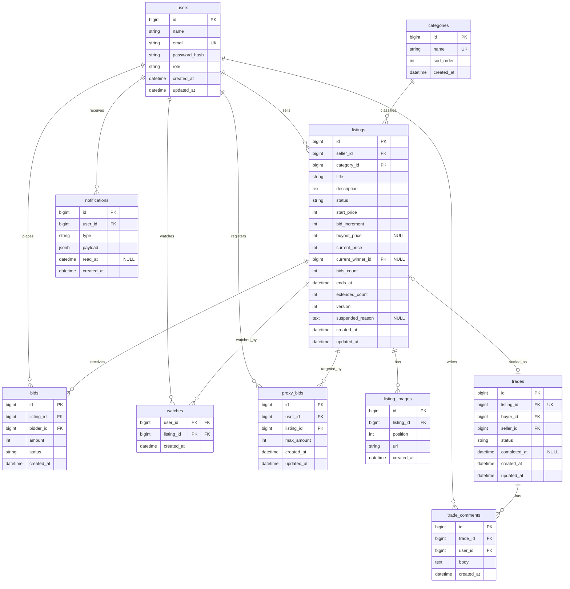
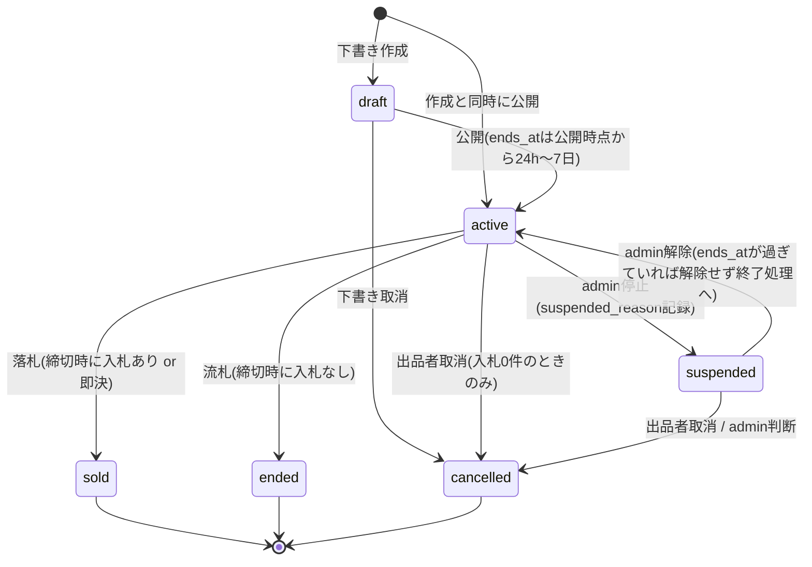
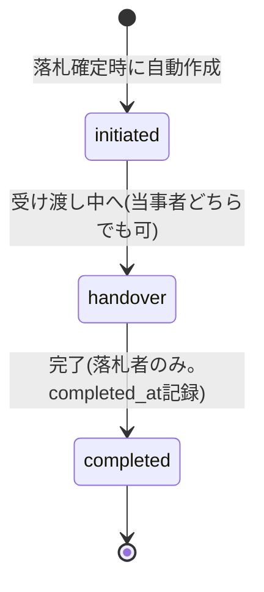

# DB設計書 — Lumina Market

PostgreSQLを前提とした論理設計です。カラム名はスネークケースで統一し、ORMの命名規則に合わせて読み替えても構いません(その場合もテーブル・カラムの対応は保つこと)。金額カラムはすべて**整数(円)**です。

## ER図

## テーブル定義

### users — ユーザー(社員)

| カラム | 型 | NULL | デフォルト | 説明 |
|---|---|---|---|---|
| id | bigint | NO | 自動採番 | 主キー |
| name | varchar(50) | NO | — | 表示名(社内なので実名運用) |
| email | varchar(255) | NO | — | UNIQUE。`@lumina.example` ドメインのみ(検証はアプリ層) |
| password_hash | varchar(255) | NO | — | bcrypt等のハッシュ。平文は保存しない |
| role | varchar(10) | NO | 'member' | `member` / `admin` |
| created_at | timestamptz | NO | now() | 作成日時 |
| updated_at | timestamptz | NO | now() | 更新日時 |

### categories — カテゴリ

| カラム | 型 | NULL | デフォルト | 説明 |
|---|---|---|---|---|
| id | bigint | NO | 自動採番 | 主キー |
| name | varchar(50) | NO | — | UNIQUE。カテゴリ名(例: 家電、家具、書籍) |
| sort_order | int | NO | 0 | 表示順(昇順) |
| created_at | timestamptz | NO | now() | 作成日時 |

### listings — 出品

| カラム | 型 | NULL | デフォルト | 説明 |
|---|---|---|---|---|
| id | bigint | NO | 自動採番 | 主キー |
| seller_id | bigint FK→users | NO | — | 出品者 |
| category_id | bigint FK→categories | NO | — | カテゴリ |
| title | varchar(100) | NO | — | タイトル |
| description | text | NO | — | 説明 |
| status | varchar(20) | NO | 'draft' | `draft` / `active` / `suspended` / `ended` / `sold` / `cancelled`(遷移図参照) |
| start_price | int | NO | — | 開始価格(円)。100以上 |
| bid_increment | int | NO | — | 入札単位(円)。10以上 |
| buyout_price | int | YES | NULL | 即決価格(円)。設定時は start_price + bid_increment 以上 |
| current_price | int | NO | — | 現在価格(円)。作成時は start_price と同値。**単調増加** |
| current_winner_id | bigint FK→users | YES | NULL | 現在の最高入札者。入札が無い間はNULL |
| bids_count | int | NO | 0 | 入札件数(相対UPDATEで加算) |
| ends_at | timestamptz | NO | — | 終了日時。公開時点から24時間以上7日以内。自動延長で後ろにずれる |
| extended_count | int | NO | 0 | 自動延長した回数。上限10(累計30分) |
| version | int | NO | 0 | 更新のたびに+1。再接続復元やデバッグでの世代確認用 |
| suspended_reason | text | YES | NULL | admin停止の理由。停止解除でNULLに戻す |
| created_at | timestamptz | NO | now() | 作成日時 |
| updated_at | timestamptz | NO | now() | 更新日時 |

### listing_images — 出品画像

| カラム | 型 | NULL | デフォルト | 説明 |
|---|---|---|---|---|
| id | bigint | NO | 自動採番 | 主キー |
| listing_id | bigint FK→listings | NO | — | 対象出品 |
| position | int | NO | — | 表示順(1〜4)。UNIQUE(listing_id, position) |
| url | varchar(500) | NO | — | 配信URL(ローカル保存: `/uploads/...`。ADV-02でS3のURLに置き換え) |
| created_at | timestamptz | NO | now() | 作成日時 |

### bids — 入札

| カラム | 型 | NULL | デフォルト | 説明 |
|---|---|---|---|---|
| id | bigint | NO | 自動採番 | 主キー |
| listing_id | bigint FK→listings | NO | — | 対象出品 |
| bidder_id | bigint FK→users | NO | — | 入札者 |
| amount | int | NO | — | 入札額(円)。即決の場合は即決価格が入る |
| status | varchar(10) | NO | 'winning' | `winning` / `outbid` / `won` / `lost`(意味論は後述) |
| created_at | timestamptz | NO | now() | 入札日時(同額先着の証跡) |

### watches — ウォッチリスト

| カラム | 型 | NULL | デフォルト | 説明 |
|---|---|---|---|---|
| user_id | bigint FK→users | NO | — | 複合主キー(user_id, listing_id) |
| listing_id | bigint FK→listings | NO | — | 複合主キー |
| created_at | timestamptz | NO | now() | 追加日時 |

### trades — 取引

| カラム | 型 | NULL | デフォルト | 説明 |
|---|---|---|---|---|
| id | bigint | NO | 自動採番 | 主キー |
| listing_id | bigint FK→listings | NO | — | **UNIQUE**。1出品につき取引は最大1件 |
| buyer_id | bigint FK→users | NO | — | 落札者 |
| seller_id | bigint FK→users | NO | — | 出品者(listingsから複写。JOIN削減用) |
| status | varchar(20) | NO | 'initiated' | `initiated` / `handover` / `completed`(遷移図参照) |
| completed_at | timestamptz | YES | NULL | 完了日時 |
| created_at | timestamptz | NO | now() | 作成日時(=落札日時) |
| updated_at | timestamptz | NO | now() | 更新日時 |

### trade_comments — 取引コメント

| カラム | 型 | NULL | デフォルト | 説明 |
|---|---|---|---|---|
| id | bigint | NO | 自動採番 | 主キー |
| trade_id | bigint FK→trades | NO | — | 対象取引 |
| user_id | bigint FK→users | NO | — | 投稿者(当事者のみ) |
| body | text | NO | — | 本文(1000文字以内) |
| created_at | timestamptz | NO | now() | 投稿日時 |

### notifications — アプリ内通知

| カラム | 型 | NULL | デフォルト | 説明 |
|---|---|---|---|---|
| id | bigint | NO | 自動採番 | 主キー |
| user_id | bigint FK→users | NO | — | 宛先ユーザー |
| type | varchar(30) | NO | — | `outbid` / `auction_won` / `listing_sold` / `listing_unsold` / `watch_price_updated` / `trade_comment` |
| payload | jsonb | NO | '{}' | 表示に必要な最小データ(例: `{"listing_id":12,"title":"モニター","current_price":3100}`) |
| read_at | timestamptz | YES | NULL | 既読日時。NULLは未読 |
| created_at | timestamptz | NO | now() | 作成日時 |

通知typeの発生タイミング:

| type | 宛先 | タイミング |
|---|---|---|
| `outbid` | 抜かれた入札者 | 最高入札者が入れ替わったとき(WebSocketの `outbid` イベントと同時に作成) |
| `auction_won` | 落札者 | 落札確定時(締切 or 即決) |
| `listing_sold` | 出品者 | 落札確定時 |
| `listing_unsold` | 出品者 | 流札時 |
| `watch_price_updated` | ウォッチしている人 | ウォッチ中の出品の現在価格が更新されたとき(入札した本人には送らない) |
| `trade_comment` | 取引の相手方 | 取引コメントが投稿されたとき |

### proxy_bids — 代理入札(Should。M4-03で使用)

| カラム | 型 | NULL | デフォルト | 説明 |
|---|---|---|---|---|
| id | bigint | NO | 自動採番 | 主キー |
| user_id | bigint FK→users | NO | — | 登録者。UNIQUE(user_id, listing_id) |
| listing_id | bigint FK→listings | NO | — | 対象出品 |
| max_amount | int | NO | — | 自動入札の上限額(円) |
| created_at | timestamptz | NO | now() | 登録日時 |
| updated_at | timestamptz | NO | now() | 更新日時 |

## インデックス・制約方針

| テーブル | インデックス / 制約 | 目的 |
|---|---|---|
| users | UNIQUE(email) | 重複登録防止・ログイン時のルックアップ |
| listings | **INDEX(status, ends_at)** | 締切スケジューラ(`status='active' AND ends_at<=now()`)と終了間近ソートの両方に効く(最重要) |
| listings | INDEX(category_id, status) | カテゴリ絞り込み |
| listings | INDEX(seller_id, created_at) | マイページの出品一覧 |
| listings | CHECK(start_price >= 100)、CHECK(bid_increment >= 10)、CHECK(buyout_price IS NULL OR buyout_price >= start_price + bid_increment) | 金額の下限をDBでも守る |
| listing_images | UNIQUE(listing_id, position) | 表示順の重複防止(1〜4) |
| bids | **INDEX(listing_id, amount DESC)** | 入札履歴(高い順)と最高額の特定 |
| bids | INDEX(bidder_id, created_at) | マイページの入札中一覧 |
| watches | PRIMARY KEY(user_id, listing_id) | 二重ウォッチ防止 |
| trades | UNIQUE(listing_id) | **二重落札をDBレベルで防ぐ最後の砦**。締切処理が二重実行されてもtradeは1件 |
| notifications | INDEX(user_id, read_at, created_at) | 未読件数と通知一覧 |
| proxy_bids | UNIQUE(user_id, listing_id) | 1出品につき1登録 |
| 各FK | ON DELETE RESTRICT | 入札・取引の履歴の整合性を守る。ユーザー・カテゴリの物理削除は不可 |

> `bids_count` / `extended_count` / `version` の更新は複数リクエストから同時に走ります。`SET bids_count = bids_count + 1` のような**相対更新**にし、アプリで読み取ってから書き戻す方式(lost updateの原因)は避けてください。`current_price` / `current_winner_id` / `ends_at` の更新は必ず**条件付きUPDATE 1文**で行います(`.claude/skills/bidding-consistency/SKILL.md`)。

## ステータス遷移

### listings.status

- `active → sold / ended` はスケジューラ(または即決)だけが行う遷移です。ユーザー操作では起きません。
- 入札が1件でも付いた `active` からの `cancelled` はありません(出品者は取り消せない)。
- `suspended` 中に `ends_at` を過ぎた場合、スケジューラは対象外(`status='active'` のみ処理)のため終了しません。admin解除時に `ends_at` が過ぎていたら、解除処理の中で終了処理(入札ありなら `sold`、なしなら `ended`)を行います。

### trades.status

- 逆方向の遷移(`handover → initiated` 等)はありません。遷移は「現在のステータスを条件に含むUPDATE」(例: `WHERE id = ? AND status = 'initiated'`)で行い、二重リクエスト時に片方が空振りするようにします。

### bids.status の意味論

`bids.status` は状態機械というより「その入札のいまの立場」を表すラベルです。次の不変条件を常に守ります。

| status | 意味 | いつ付くか |
|---|---|---|
| `winning` | 現在の最高入札。**1出品につき常に0件または1件** | 入札成立時に新しい入札へ付与 |
| `outbid` | 他の入札に抜かれた | 新しい入札の成立時に、それまでの `winning` を `outbid` に更新 |
| `won` | 落札した(終端) | 締切処理・即決時に `winning → won` |
| `lost` | 落札できなかった(終端) | 締切処理・即決時に `outbid → lost`(`winning` 以外をすべて確定) |

- オークション進行中(`active`)に存在するのは `winning` / `outbid` のみ、確定後(`sold`)に存在するのは `won` / `lost` のみです。
- `winning` の入札の `amount` は常に `listings.current_price` と一致し、`bidder_id` は `listings.current_winner_id` と一致します。この2つの整合が崩れていたら入札処理にバグがあります(競合テストのassert対象。M2-01)。
- 更新は同一トランザクション内で「旧 `winning` → `outbid`」→「新規INSERT(`winning`)」の順に行います。
