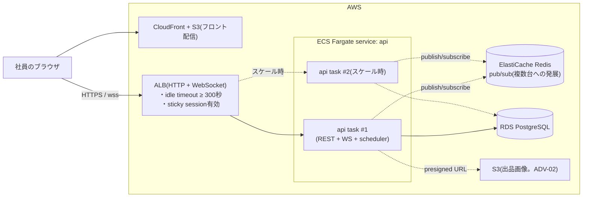

# インフラ設計書 — Lumina Market

## ローカル開発構成(これだけで全課題が完結します)

docker composeで必須なのは**PostgreSQLだけ**です。画像はAPIコンテナ(またはホスト)のローカルディスクに保存します。AWSアカウントは不要です。

| サービス | 役割 | ポート(ホスト側) | 必須か |
|---|---|---|---|
| db | PostgreSQL 16 | 5432 | 必須 |
| api | 自作。REST API + WebSocket + 締切スケジューラ(1プロセス) | 3000 | 必須(ホスト直起動でも可) |
| web | 自作。フロントエンド(React等) | 5173 | 任意(apiに同居・配信でも可) |

composeファイルのスケルトン(言語非依存。`api` / `web` のbuild部分を自分のスタックに合わせます):

```yaml
services:
  db:
    image: postgres:16
    environment:
      POSTGRES_USER: market
      POSTGRES_PASSWORD: market
      POSTGRES_DB: market
    ports: ["5432:5432"]
    volumes: [db-data:/var/lib/postgresql/data]

  api:
    build: .
    command: <apiサーバー起動コマンド>
    environment:
      DATABASE_URL: postgres://market:market@db:5432/market
      JWT_SECRET: local-dev-secret
      UPLOAD_DIR: /app/uploads
      ALLOWED_EMAIL_DOMAIN: lumina.example
    ports: ["3000:3000"]
    volumes: [uploads:/app/uploads]
    depends_on: [db]

  # web は任意。Vite等の開発サーバーをホストで直接起動しても構いません

volumes:
  db-data:
  uploads:
```

- **API・WebSocket・締切スケジューラは同一プロセス(1コンテナ)**にまとめます。roomや接続の管理はプロセス内メモリで持てるため、これが最も素直な構成です(複数プロセス化は後述の「発展」)。
- 画像は `UPLOAD_DIR` に保存し、`/uploads/*` を静的配信します。composeの named volume にしておくとコンテナ再作成でも消えません。
- 時刻まわりのテストのため、DBとAPIのタイムゾーンはUTCに統一することを推奨します(表示のみJST変換)。

## 本番想定AWS構成(設計のみ。デプロイは任意)

「もし全社導入するなら」の想定構成です。**WebSocketがあるため、通常のREST APIと違う注意点**(ALBの設定、複数台時のブロードキャスト)が本項の主題です。

### 全体図



### WebSocket特有の注意点

| 項目 | 内容 |
|---|---|
| ALBのidle timeout | 既定60秒では無通信のWebSocketが切られます。300秒以上に延ばし、かつクライアント/サーバーでping/pong(30秒間隔程度)を打ちます。「たまに切れる」前提で再接続 + `GET /api/listings/:id/state` の復元(M3-05)が本命の対策です |
| sticky session | WebSocketは接続が張りっぱなしなので自然に同一タスクに留まりますが、再接続時に別タスクへ振られます。1台構成なら問題は起きません。複数台では次項のpub/subが必須です |
| 複数台へのスケール(発展) | roomの接続はタスクごとのメモリにあるため、タスクAで成立した入札の `price_updated` はタスクBの接続に届きません。**Redis pub/sub**(チャンネル: `listing:<id>`)に各タスクがsubscribeし、イベントを全タスク経由で配信する構成に発展させます。本プロジェクトの実装は**1プロセス前提でよく**、この発展はスコープ外です(設計として理解しておくこと) |
| 締切スケジューラの多重化 | タスクを2台にするとスケジューラも2つ走ります。終了処理は条件付きUPDATE(`WHERE status='active' AND ends_at<=now()`)+ `trades.listing_id` のUNIQUEで冪等なので二重確定は起きませんが、通知・配信の重複を避けるなら「UPDATEに成功した行だけ後処理する」実装を守ること(1台でも同じ書き方になります。`.claude/skills/bidding-consistency` 参照) |

### コスト注意(実際にデプロイする場合)

- **RDS・ALB・Fargate・ElastiCacheは無料枠を超えやすい**代表格です。試すなら最小構成 + 短期間にしてください(合計で月$50〜を覚悟)。
- ADV-02(画像のS3化)のS3バケット + presigned URLはほぼ無料枠内ですが、バケットの公開設定ミスに注意してください(SNSカリキュラムのTerraform教材と同方式)。
- 学習が終わったら `terraform destroy` とマネジメントコンソールの両方で消し忘れ(特にRDSスナップショット、ALB、NAT Gateway)を確認してください。**本プロジェクトはローカルで完結するため、デプロイは完全に任意です。**
