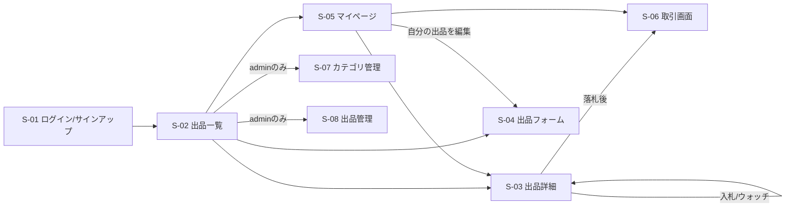
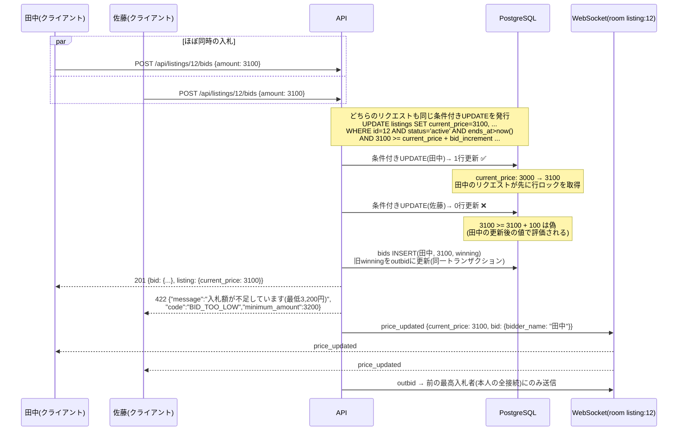

# 画面定義書 — Lumina Market

フロントエンドはReactを推奨しますが、フレームワークは自由です。デザインは問いません(素のCSSで十分)。この定義書は「何が表示・操作できるか」と「リアルタイム要素がどう動くか」を固定します。

## 画面一覧

| ID | 画面 | ロール | 概要 |
|---|---|---|---|
| S-01 | ログイン / サインアップ | 全員 | Cookie + JWT認証。サインアップは `@lumina.example` のみ(エラーcode `DOMAIN_NOT_ALLOWED` の文言表示) |
| S-02 | 出品一覧(トップ) | member / admin | 検索(キーワード・カテゴリ)、ソート(新着 / 終了間近 / 人気)、ページネーション。カードに現在価格・入札数・残り時間 |
| S-03 | 出品詳細 | member / admin | **リアルタイム画面(本プロジェクトの主役)**。構成は後述 |
| S-04 | 出品フォーム(作成・編集) | member / admin | タイトル、説明、カテゴリ、画像(最大4枚)、開始価格、入札単位、即決価格(任意)、終了日時。下書き保存と公開 |
| S-05 | マイページ | member / admin | タブ: 出品中 / 出品履歴 / 入札中(勝ち負けバッジ) / 落札・取引。通知一覧(未読バッジ) |
| S-06 | 取引画面 | 当事者のみ | 取引ステータス(initiated / handover / completed)の表示と遷移ボタン、コメント欄(受け渡し相談) |
| S-07 | カテゴリ管理 | admin | カテゴリのCRUDと並び順 |
| S-08 | 出品管理(admin) | admin | 全出品の一覧と停止 / 停止解除(理由の入力) |

## 画面遷移図



## S-03 出品詳細のリアルタイム要素

この画面がWebSocket実装のすべてを受け止めます。各要素がどのイベント(名前は [api.md](api.md) の「WebSocketイベント一覧」と完全一致)で更新されるかを固定します。

| 表示要素 | 初期値の取得 | 更新のトリガー |
|---|---|---|
| 現在価格・入札件数 | `GET /api/listings/:id`(または `/state`) | `price_updated` |
| 入札履歴(新しい順) | `GET /api/listings/:id/bids` | `price_updated`(先頭に `data.bid` を追加) |
| 残り時間カウントダウン | `ends_at` からクライアントで毎秒計算 | `auction_extended`(ends_atを差し替え、「延長されました」を表示) |
| 閲覧人数 | 接続後の `viewer_count` イベント | `viewer_count` |
| 「あなたが最高入札者です」バッジ | `/state` の `my_bid_status` | `price_updated`(自分の入札なら表示)、`outbid`(バッジを外し警告表示) |
| 入札負けアラート(トースト等) | — | `outbid`(`minimum_amount` 付きで再入札を促す) |
| 終了表示(落札者・最終価格 / 流札) | statusが `sold` / `ended` なら最初から表示 | `auction_ended`(入札フォームを無効化し結果を表示) |
| 入札フォーム | 最低入札額 = `/state` から計算 | `price_updated`(最低額を `current_price + bid_increment` に更新) |

実装ルール:

- ページ表示で `/ws` に接続し `join`、離脱で `leave` を送ります(SPAの画面遷移でも忘れずに)。
- 残り時間はサーバーから秒単位でプッシュ**しません**。クライアントが `ends_at` との差分を毎秒描画します(`auction_extended` で基準を差し替えるだけ)。
- **切断→再接続時は必ず `GET /api/listings/:id/state` で追いつき**、それからイベント購読を再開します。切断中のイベントは失われる前提です(取りこぼしをUIで補完しない)。
- 自分の入札の成功はPOSTレスポンスで即時反映して構いません。その後に届く自分起因の `price_updated` は `version` 比較(またはbid id比較)で二重適用を避けます。

## 入札判定のシーケンス図(同時入札の勝敗)

田中と佐藤が**同額3,100円**をほぼ同時に入札したときの勝敗です(現在価格3,000円、入札単位100円)。「先にDBの条件付きUPDATEに成功した方が勝ち、後着は `BID_TOO_LOW`」という同額先着ルールが、アプリのif文ではなく**UPDATEのWHERE句**で決まることを示します。



- 佐藤の敗因は「同額で後着」だったことです。佐藤のUPDATEは田中のトランザクション確定を待ってから**更新後の値**で条件を再評価するため、自動的に不成立になります。アプリ側での「先にSELECTして検証」は不要であり、やってはいけません(check-then-act競合。`.claude/skills/bidding-consistency` 参照)。
- 佐藤の画面には、422レスポンスの `minimum_amount` と、直後に届く `price_updated` の両方で「現在3,100円、次は3,200円から」が表示されます。

## UIを最小にする場合の代替確認

フロントエンドを簡素にする(または後回しにする)場合も、リアルタイム要素はコマンドラインで確認できます。

```bash
# REST: 入札
curl -s -X POST -b cookie.txt -H "Content-Type: application/json" \
  -d '{"amount": 3100}' http://localhost:3000/api/listings/12/bids | jq .

# WebSocket: 購読(websocatの例。Cookieを渡してhandshake)
websocat -H "Cookie: token=<JWT>" ws://localhost:3000/ws
# 接続後に join を送る
{"event":"join","data":{"listing_id":12}}
```

ただしS-03(出品詳細)だけは、`price_updated` によるリアルタイム更新・カウントダウン・`outbid` トーストが**目で見て動く**状態まで作ることを推奨します(M4-05のデモ動画・GIFの主役になります)。
